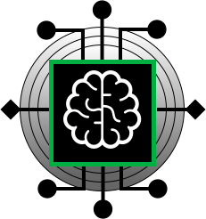

# .github
# Numerical Simulations and Artificial Intelligence Laboratory (LSNIA)

  

<em>LSNIA, Guilherme Faura.</em>

 

The Numerical Simulations and Artificial Intelligence Laboratory (LSNIA) develops research in computational mathematics, artificial intelligence and engineering applications (e.g., fluid dynamics). Its website can be accessed <a href="https://lsnia-unesp.github.io/" target="_blank">here</a>.
